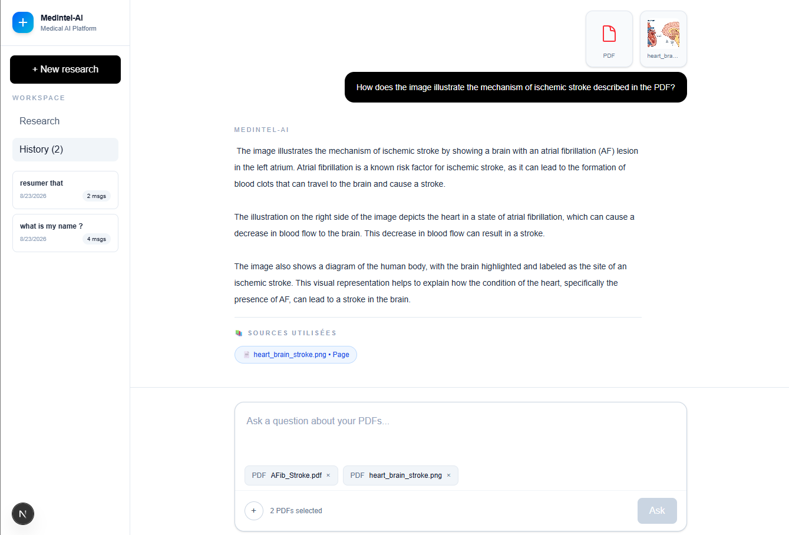
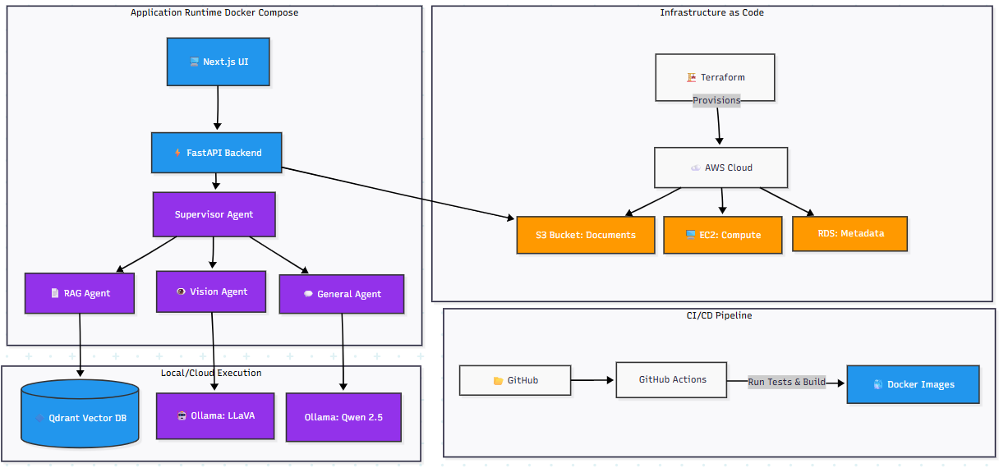

# MedRAG-Engine

**A Local-First Medical Research Platform Powered by Advanced RAG and Multimodal AI**


---

## Overview

**MedRAG-Engine** is a local-first Retrieval-Augmented Generation platform for biomedical research that combines document and image analysis with on-premise LLMs and vector search to deliver evidence-based answers while keeping data private.

**Built-From-Scratch RAG Pipeline:** MedRAG-Engine implements a complete RAG system from the ground up—ingesting PDFs, chunking text intelligently, vectorizing content using sentence-transformers, indexing in Qdrant for fast semantic search, and retrieving contextually relevant passages. A Supervisor agent intelligently routes queries to specialized agents (RAG, Vision, General) which augment context and call local LLMs (Ollama: qwen2.5:7b for text, llava:7b for vision) to generate accurate answers with explicit source attribution (document name + page number).

---

## 🎥 Demonstration

### 📸 Screenshot

<p align="center">
  
</p>

### 🎬 Detailed demonstration video

Watch the full video demonstration on Google Drive :

👉 [**Link to the demonstration video**](https://drive.google.com/file/d/VOTRE_ID_VIDEO/view)

---

## Key Features

- **Multi-Document RAG Pipeline (Built from Scratch)** — Custom end-to-end implementation with document ingestion, semantic chunking, sentence-transformer vectorization, Qdrant indexing, and retrieval; efficiently handles multiple PDFs with precise source attribution
- **Multimodal Analysis** — Processes both text documents and medical images (radiographs, graphs, diagnostic imaging)
- **Local LLM Inference** — Powered by Ollama with specialized models for text (`qwen2.5:7b`) and vision (`llava:7b`) tasks
- **Agentic Architecture** — Intelligent supervisor agent that routes queries to specialized agents (Supervisor, RAG, Vision, General)
- **Dual-Mode Operation**
  - **Research Mode** — Answer specific questions based on uploaded medical documents
  - **General Mode** — Query general medical knowledge without documents
- **Modern UI** — Production-ready interface built with Next.js, TypeScript, and Tailwind CSS
- **Enterprise-Grade Deployment** — Docker containerization, CI/CD pipelines, and cloud-ready infrastructure

---

## Technology Stack

| Component | Technology |
|-----------|-----------|
| **Frontend** | Next.js, TypeScript, Tailwind CSS |
| **Backend** | Python, FastAPI |
| **Vector Database** | Qdrant |
| **Embeddings** | sentence-transformers (all-MiniLM-L6-v2) |
| **Text LLM** | Ollama (qwen2.5:7b) |
| **Vision LLM** | Ollama (llava:7b) |
| **Containerization** | Docker, Docker Compose |
| **CI/CD** | GitHub Actions |
| **Infrastructure** | AWS, Terraform |

---

## System Architecture

<p align="center">
  
</p>

---

## Quick Start

### Prerequisites

- Python 3.11 or later
- Node.js 18 or later
- Docker Desktop
- Ollama ([download](https://ollama.com))

### Docker Compose (Recommended)

The fastest way to run MedRAG-Engine with all services:

```bash
# 1. Clone the repository
git clone https://github.com/MDMAK04/MedRAG-Engine.git
cd MedRAG-Engine

# 2. Pull required Ollama models
ollama pull qwen2.5:7b
ollama pull llava:7b

# 3. Start all services
docker compose -f docker/docker-compose.yml up

# 4. Access the application
# Frontend: http://localhost:3000
# Backend API: http://localhost:8000
```

### Manual Installation

#### Step 1: Start Vector Database

```bash
docker run -d --name qdrant -p 6333:6333 qdrant/qdrant
```

#### Step 2: Setup Ollama

```bash
ollama pull qwen2.5:7b
ollama pull llava:7b
```

#### Step 3: Install and Run Backend

```bash
python -m venv venv
source venv/bin/activate  # On Windows: venv\Scripts\activate
pip install -r requirements.txt
python -m uvicorn backend.main:app --reload --port 8000
```

#### Step 4: Install and Run Frontend

```bash
cd frontend
npm install
npm run dev
```

#### Step 5: Open Application

Visit `http://localhost:3000` in your browser.

---

## Usage Examples

### Medical Document Analysis

1. Click the upload button (**+**) to add PDF documents
2. Ask comparative or analytical questions:
   - *"Compare the risk factors for ischemic stroke across all uploaded documents"*
   - *"Summarize the treatment protocols for COVID-19 from these studies"*
3. Review the structured response with source attribution (document and page references)

### Medical Image Analysis

1. Upload a medical image (X-ray, CT scan, radiograph, etc.)
2. Ask for analysis:
   - *"Describe the findings in this chest X-ray"*
   - *"Identify any abnormalities in this image"*
3. The Vision Agent provides detailed clinical interpretation

---

## CI/CD and Deployment

### GitHub Actions Pipeline

On every `git push` to the `main` branch:
- Code validation (dependency installation and testing)
- Docker image building
- Automatic publishing to Docker Hub

**Published Images:**
- Backend: [`elmakhloufi/medrag-backend`](https://hub.docker.com/r/elmakhloufi/medrag-backend)
- Frontend: [`elmakhloufi/medrag-frontend`](https://hub.docker.com/r/elmakhloufi/medrag-frontend)

### Cloud Deployment (AWS with Terraform)

The entire cloud infrastructure is defined as code and can be deployed to AWS in minutes. Terraform configuration files are located in `deployment/terraform/`:

```
deployment/terraform/
├── main.tf          # AWS resources (S3, RDS, EC2)
├── variables.tf     # Configuration variables
└── outputs.tf       # Infrastructure outputs
```

**Infrastructure Components:**
- **S3 Bucket** — Secure document storage
- **RDS (PostgreSQL)** — Metadata and application database
- **EC2 Instance** — Qdrant vector database server
- **Security Groups & IAM Roles** — Network and access control

**Deployment:**
```bash
cd deployment/terraform
terraform init
terraform plan
terraform apply
```

> **Infrastructure Management:** The complete cloud architecture is fully reproducible and can be deployed to any AWS account within minutes using `terraform apply`. For cost optimization and compliance, ensure to review and adjust resource specifications in `variables.tf` before deployment.

**Security Note:** Sensitive credentials (database passwords, API keys) are stored in `terraform.tfvars` (git-ignored), never in version control.

---

## Security and Privacy

- **Zero Cloud Dependency** — All AI inference runs locally
- **Data Confidentiality** — Medical documents and images never leave your infrastructure
- **Controlled Execution** — Python tools run in sandboxed environments
- **Compliance-Ready** — Suitable for HIPAA, GDPR, and other healthcare privacy standards

---

## What This Project Demonstrates

- **Advanced RAG Implementation (Built from Scratch)** — Complete custom pipeline with PDF ingestion, intelligent text chunking, sentence-transformer vectorization, Qdrant vector storage, semantic retrieval, and LLM-augmented generation—no external RAG frameworks
- **Agentic AI Architecture** — Supervisor pattern with specialized agents for different task types (RAG, Vision, General query)
- **Multimodal Processing** — Unified interface for text and vision-based analysis with separate LLM models
- **Local/Private AI** — No external API dependencies or cloud data transmission; all processing on-premise
- **Full-Stack Development** — FastAPI backend with Next.js frontend, TypeScript type safety across the stack
- **Enterprise DevOps** — Docker, GitHub Actions, CI/CD, container registry integration
- **Infrastructure as Code** — Terraform configuration for reproducible cloud deployment
- **Tested** — Unit tests implemented for API and chunking; CI/CD pipeline runs tests before deployment

---

## 🧪 Tests

MedRAG-Engine est livré avec une suite de tests unitaires qui garantissent la qualité du code.

### Tests inclus :
- **`tests/test_api.py`** : Vérifie que l'API FastAPI démarre et répond correctement.
- **`tests/test_chunker.py`** : Vérifie que la fonction de découpage de texte (`chunk_text`) fonctionne correctement.

### Exécuter les tests :
```bash
pytest -v
```
---

## Project Structure

```
MedRAG-Engine/
├── backend/                  # FastAPI application
│   ├── api/                 # API routes (chat, upload)
│   ├── generation/          # Text generation and LLM services
│   │   ├── __init__.py
│   │   └── llm_service.py   # LLM inference wrapper
│   ├── ingestion/           # Document processing pipeline
│   │   ├── __init__.py
│   │   ├── pdf_ingestion.py # PDF extraction and vectorization
│   │   ├── chunker.py       # Semantic text chunking algorithms
│   │   └── pdf_processor.py # PDF processing utilities
│   ├── orchestration/       # Agent orchestration and routing
│   │   ├── __init__.py
│   │   ├── agent_orchestrator.py  # Supervisor agent with question classification
│   │   └── vision_agent.py   # Vision agent for image analysis
│   ├── retrieval/           # Vector search and semantic retrieval
│   │   ├── __init__.py
│   │   └── retriever.py     # Qdrant vector search with multi-document support
│   ├── schemas/             # Data models (ChatResponse, etc.)
│   └── main.py              # FastAPI application entry point
├── frontend/                # Next.js application
│   ├── app/                 # React components and pages
│   ├── public/              # Static assets
│   └── package.json         # Dependencies
├── docker/                  # Docker build files
├── deployment/              # Deployment configurations
│   └── terraform/           # AWS infrastructure as code
└── requirements.txt         # Python dependencies
```

---

## Contributing

Contributions are welcome. Please ensure code follows the project's standards and include appropriate tests.

---

## License

MIT License — See LICENSE file for details

---

## Author

**MDMAK04**  
AI Engineer | Full-Stack Developer

- GitHub: [MDMAK04](https://github.com/MDMAK04)
- LinkedIn: https://www.linkedin.com/in/mohammed-el-makhloufi/

---

## Acknowledgments

This project leverages excellent open-source tools:
- [Ollama](https://ollama.com) for local LLM inference
- [Qdrant](https://qdrant.tech) for vector database
- [sentence-transformers](https://www.sbert.net) for embeddings
- [FastAPI](https://fastapi.tiangolo.com) for backend framework
- [Next.js](https://nextjs.org) for frontend framework
